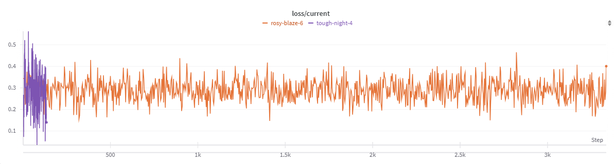
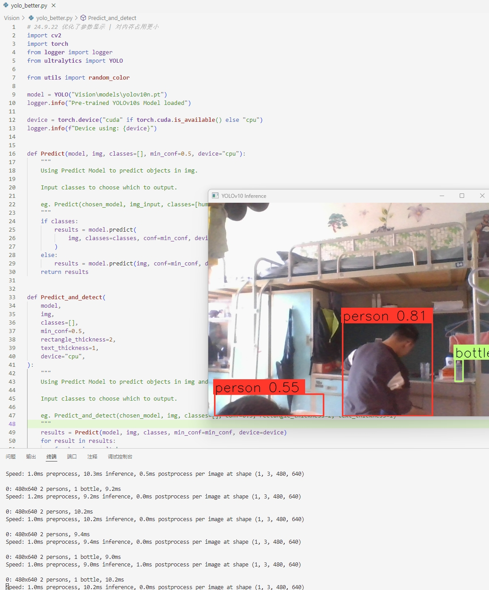
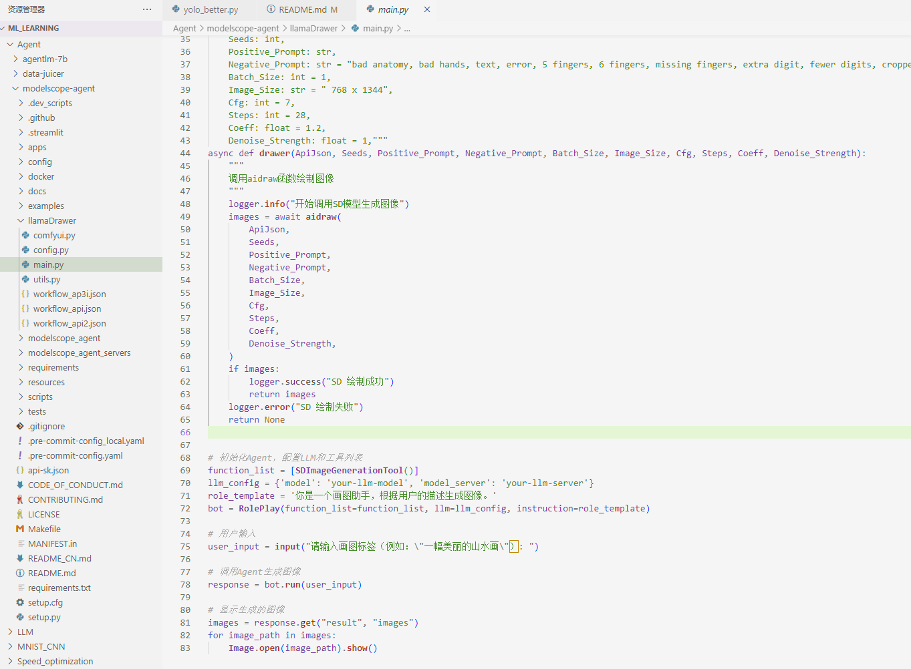

# ML_learning

 

> [!NOTE]\
> 所有运行结果均在本readme里, 位于details中

主观路线图
--- 

### 基础部分可以看 [deeplearningbook-chinese](https://github.com/exacity/deeplearningbook-chinese)

- 0 数学基础
  - 0.1 线性代数
    - 向量、矩阵和张量
    - 特征分解
    - 行列式
  - 0.2 概率与信息论
  - 0.3 梯度的优化方法

- 1 机器学习
  - 1.1 机器学习概念与应用
  - 1.2 监督学习与无监督学习
  - 1.3 数据预处理与特征提取
  - 1.4 线性回归
  - 1.5 决策树与随机森林
  - 1.6 岭回归与支持向量回归
  - 1.7 聚类算法
  - 1.8 马尔科夫链

- 2 深度学习
  - 2.1 感知机模型
  - 2.2 反向传播算法
  - **! Must Read: Pytorch or Tensorflow**
    - [这个是官方教程，比较复杂，但是最好看一下]( https://pytorch.org/tutorials/)
    - [这个是我比较推荐的 Notebook 形式的学习，可以随时试一下示例](https://aiplusx.momodel.cn/classroom/class/664bf5db24cff38ad7d2a20e?activeKey=section)  
  - 2.3 激活函数
  - 2.4 卷积神经网络 CNN
  - 2.5 ResNet模型
  - 2.6 循环神经网络 RNN
  - 2.7 对抗神经网络 GAN
  - 2.8 **Transformer**

- 3 视觉模型
  - 3.1 早期视觉模型 (GAN, ResNet)
  - 3.2 **CLIP**
  - 3.3 **ViT (Vision Transformer)**
  - 3.4 NeRF vs. 3D Gaussian Spatting (3D) **# 选读**
  - 3.5 Diffusion Models
    - 3.5.1 **Latent Diffusion Models**
    - 3.5.2 Stable Diffusion
      - 3.5.2.1 文本编码器 **CLIP**
      - 3.5.2.2 图像编码器 **ViT & U-Net**
      - 3.5.2.3 噪声解码器 **VAE**
      - 3.5.2.4 ControlNet的思想
      - 3.5.2.5 IPAdapter的思想 **# 选读**
      - 3.5.2.6 其他的模型 **# 选读**
  - 3.6 新生代自回归模型 **# 选读**

- 4 自然语言处理
  - 4.1 Word2Vec
  - 4.2 Positional Encoding
  - 4.3 BERT与T5
  - 4.4 GPT-2与LlaMA
  - 4.5 RWKV与Mamba **# 选读**

- 5 高效模型 **# 选读**
  - 5.1 CUDA Core vs. Tensor Core
  - 5.2 Pipeline 的思想
  - 5.3 Huggingface Accelerate
  - 5.4 TensorRT
  - 5.5 MPI基础 & SSH
  - 5.6 NVIDIA Docker vs. Singularity
  - 5.7 负载均衡 & 分布式
  - 5.8 模型压缩 & 量化
  - 5.9 Attention 相关的一些方法 **# 选读**

- 6 模型烘焙方法 & Tricks **# 这部分可以自己去查查，发散一些好 :D**
  - 6.1 适应性微调训练
  - 6.2 量化感知训练
  - 6.3 数据增强训练
  - 6.4 状态增强训练
  - 6.5 全量训练与权重冻结
  - 6.6 模式专家系统
  - 6.7 训练后量化增强
  - 6.8 低精度训练加速 & 混合精度训练
  - 6.9 知识蒸馏与迁移训练
  - 6.10 知识库与RAG匹配算法
  - 6.11 Chain of thought 思维链与知识图谱
  - 6.12 模型蒸馏与知识蒸馏

- 7 Agent 相关
  - 7.1 框架选择

#### 未完待续

原README
--- 

#### From https://gitee.com/xforcevesa/loongchip/blob/master/docs/presentation/exam.md

### 附：
# 系统能力大赛与人工智能组考核方案

- 旧有考核方案见[此处](./exam.old.md)，亦可供参考
- 考核时提问：指针对任务所实现的代码、运行过程、实现原理或某些技术、知识点的提问
- 所有链接资料仅供参考
- 新考核方案如下：

## 人工智能考核内容

以下内容可七选四完成：

- [ ] 1. 使用C/C++实现一个简单的机器学习算法
    - 具体：实现梯度下降算法，进行线性拟合等任务，并实时打印loss值
    - 要求：算法实现代码需包含注释，并附上算法的基本原理和推导过程
    - 展示方式：当场展示（可线上）+可复现源码及其文档
    - 资料：
        1. [梯度下降算法原理](https://dsfftp.readthedocs.io/zh-cn/latest/Linear-Regression/%E6%A2%AF%E5%BA%A6%E4%B8%8B%E9%99%8D%E6%B3%95%E7%9A%84%E6%95%B0%E5%AD%A6%E5%8E%9F%E7%90%86.html)
        2. [梯度下降算法实现demo](https://blog.csdn.net/AbBaCl/article/details/78817775)
- [x] 2. [实现一个基于深度学习的图像分类算法](./MNIST_CNN/)
    - 具体：使用TensorFlow或PyTorch实现一个卷积神经网络，并训练模型进行图像分类
    - 要求：算法实现代码需包含注释，并附上算法的基本原理和推导过程
    - 展示方式：当场展示（可线上）+考核时提问+可复现源码及其文档
    - 备注：采用开源数据集，展示时请放出训练loss曲线
    - 资料：
        1. [卷积神经网络原理](https://zh.d2l.ai/chapter_convolutional-neural-networks/index.html)
        2. [MNIST数据集图像分类](https://pytorch.org/tutorials/beginner/basics/optimization_tutorial.html)
   
    
 
    
运行结果

    [mnist_cnn.checkpoint](./MNIST_CNN\mnist_cnn.checkpoint)
    

- [x] 3. 实现一个基于深度学习的序列预测与生成模型
    - 具体：使用TensorFlow或PyTorch实现一个LSTM/GRU/GPT等模型选其一，并训练模型进行序列预测与生成
    - 要求：算法实现代码需包含注释，并附上算法的基本原理和推导过程
    - 展示方式：当场展示（可线上）+考核时提问+可复现源码及其文档
    - 备注：此处序列可以是时序数据。展示时请放出训练loss曲线
    - 资料：
        1. [LSTM/GRU原理](https://towardsdatascience.com/illustrated-guide-to-lstms-and-gru-s-a-step-by-step-explanation-44e9eb85bf21)
        2. [Transformer for Time Series](https://medium.com/intel-tech/how-to-apply-transformers-to-time-series-models-spacetimeformer-e452f2825d2e)

    
 
    
运行结果

    
    
    

- [x] 4. [实现一个图像物体识别算法与模型](./Vision/)
    - 具体：使用Python或其他编程语言实现一个基于规则或深度学习的图像物体识别算法，并训练模型进行图像分类
    - 要求：算法实现代码需包含注释，并附上算法的基本原理和推导过程
    - 展示方式：当场展示（可线上）+考核时提问+可复现源码及其文档
    - 备注：可选开源数据集如COCO、VOC等，展示时请放出训练loss曲线
    - 资料：
        1. [Ultralytics](https://www.ultralytics.com/)
        2. [OpenCV Tutorial](https://opencv-python-tutorials.readthedocs.io/)   

    
 
    
运行结果

    
    

- [x] 5. [实现一个初等的自然语言处理模型](./LLM/LLaMA-Factory/)
    - 具体：使用Python或其他编程语言实现一个基于规则或深度学习的自然语言处理模型，并训练模型进行文本分类或生成
    - 要求：算法实现代码需包含注释，并附上算法的基本原理和推导过程
    - 展示方式：当场展示（可线上）+考核时提问+可复现源码及其文档
    - 备注：请实现Transformer、Mamba、RWKV及其衍生模型
    - 资料：
        1. [Transformer原理](https://blogs.nvidia.com/blog/what-is-a-transformer-model/)
        2. [LLM Comprehensive View](https://arxiv.org/abs/2401.02038)
        3. [nanoGPT](https://github.com/karpathy/nanoGPT)   
    
    
 

    [llamaDrawer-7B.safetensors](./Agent/LLaMA-Factory\llamaDrawer-7B.safetensors)
    

- [x] 6. [实现一个自定功能的AI智能体模型](./Agent/)
    - 具体：使用Python或其他编程语言实现一个基于规则或深度学习的智能体模型，并训练模型进行智能决策
    - 要求：算法实现代码需包含注释，并附上算法的基本原理和推导过程
    - 展示方式：当场展示（可线上）+考核时提问+可复现源码及其文档
    - 备注：AI智能体的功能可自行DIY
    - 资料：
        1. [MoFA框架](https://github.com/moxin-org/mofa/)
        2. [Awesome AI Agents](https://github.com/e2b-dev/awesome-ai-agents)
   
    
 

    [llamaDrawer](./Agent/modelscope-agent/llamaDrawer/main.py)
    
    

- [x] 7. [实现一个大模型训练推理优化的方法或工具](./Speed_optimization/)
    - 具体：使用Python与C++、CUDA等，实现一个大模型训练推理优化的方法或工具，并分析其优缺点
    - 要求：算法实现代码需包含注释，并附上算法的基本原理和推导过程
    - 展示方式：当场展示（可线上）+考核时提问+可复现源码及其文档
    - 备注：可选大模型如LlaMA-2-7B等，展示时请放出优化前后推理或训练速度对比
    - 资料：
        1. [LlaMA模型](https://github.com/meta-llama/llama)
        2. [TensorRT-LLM](https://github.com/NVIDIA/TensorRT-LLM)
        3. [onnxruntime](https://github.com/microsoft/onnxruntime)
        4. [TVM](https://github.com/apache/tvm)
        5. [XLA](https://github.com/openxla/xla)
   
    
 

    [Speed_optimization_docker-compose.yml](./Speed_optimization\Model_Transform\LLM\docker-compose.yml)
    

相关链接：
   1. https://paperswithcode.com/
   2. https://huggingface.co/
   3. https://www.kaggle.com/
   4. https://roboflow.com/
