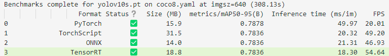

# 4. 图像物体识别算法

    python yolo_better.py

 

运行结果
 

### 使用模型：Yolov10s
### 训练数据集：coco8

### 原理：调用摄像头并实时推理，识别出图像中出现的物体。

### 提速方法：
- 1.将模型导入显存，借助Cuda提升推理速度。
- 2.使用TensorRT/Onnx等模型优化工具，提升推理速度。

### 不同模型性能测试:

